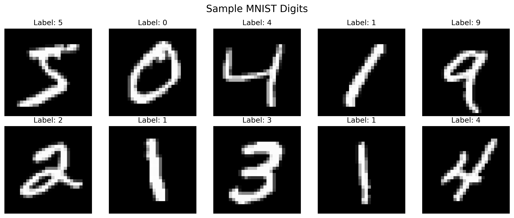
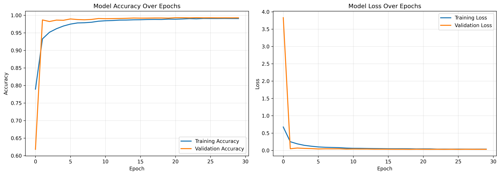
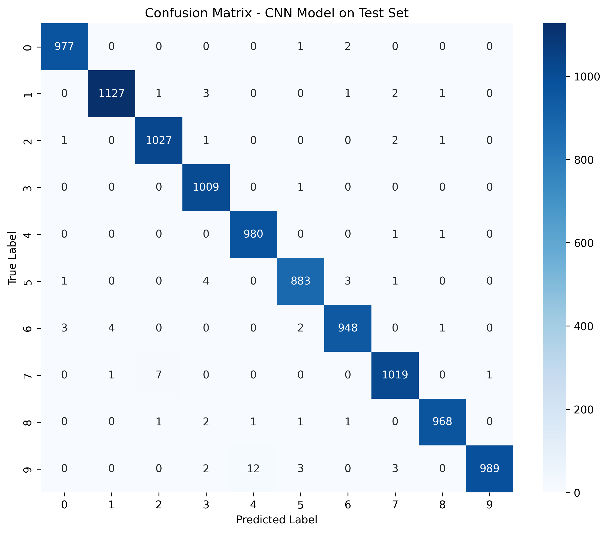

# MNIST Handwritten Digit Recognition with CNN

Deep Learning project implementing Convolutional Neural Networks for digit classification.



## Project Overview

This project was developed as part of my Master in Data Science and AI coursework. It demonstrates CNN application for image classification, achieving **99.27% accuracy** on the MNIST test set.

## Key Results

| Model | Test Accuracy |
|-------|---------------|
| Logistic Regression (Baseline) | 92.57% |
| **CNN Model** | **99.27%** |



## Model Architecture

- 3 Convolutional blocks (32, 64, 128 filters)
- Batch Normalization for stability
- Max Pooling for dimension reduction
- Dropout (0.5, 0.3) for regularization
- Dense layers for classification
- **905,418 total parameters**

**Optimizer:** Adam (lr=0.001)  
**Loss:** Categorical Cross-Entropy

## Performance

- **Training Accuracy:** 99.54%
- **Validation Accuracy:** 99.27%
- **Test Accuracy:** 99.27%
- **Error Rate:** 0.73% (73 errors out of 10,000)



## Technologies

- Python 3.8+
- TensorFlow 2.19.0
- NumPy, Matplotlib, Seaborn
- scikit-learn

## How to Run

1. Open in Google Colab:
   - Upload `Untitled0.ipynb`
   - Run all cells
   - MNIST dataset downloads automatically

2. Or run locally:
```bash
pip install tensorflow numpy matplotlib seaborn scikit-learn pandas
jupyter notebook Untitled0.ipynb
```

## Project Structure
```
mnist-cnn-project/
├── Untitled0.ipynb                    # Main notebook
├── README.md                          # This file
├── sample_digits.png                  # Visualizations
├── class_distribution.png
├── data_augmentation_examples.png
├── training_curves.png
├── confusion_matrix.png
├── misclassified_examples.png
├── model_comparison.png
└── mnist_cnn_model.keras             # Trained model
```

## Key Findings

- CNNs significantly outperform traditional ML methods (+6.7%)
- Batch normalization improves training stability
- Data augmentation prevents overfitting
- Common confusions: 4↔9, 3↔8, 7↔1


**Adela Sinani**  
Master's in Data Science and Artificial Intelligence  

